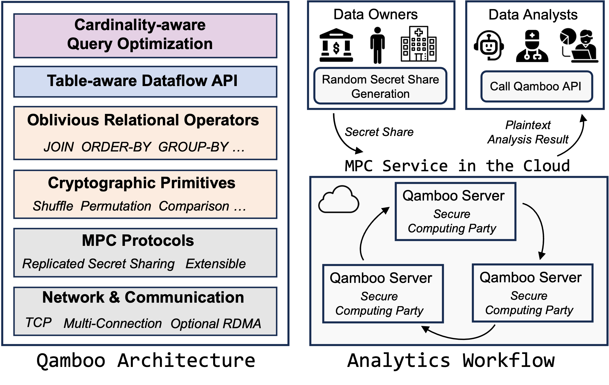

# Qamboo: An MPC Framework for Efficient and Scalable Relational Analytics

Qamboo brings secure multi-party computation to relational analytics, allowing distrusting parties to jointly query their combined data without exposing it. Details can be found in our paper (Accepted by NSDI '27). Full API documentation is available at the [project docs page](https://shwenli.github.io/Qamboo/).

## For NSDI Artifact Evaluation

**Reviewers: please start with [`nsdi27-ae/README.md`](nsdi27-ae/README.md).** It is the dedicated artifact evaluation guide for the NSDI 2027 paper and contains everything needed to reproduce our results:

- **Badge claims** (Available / Functional / Reproduced) and the mapping from paper claims to experiments.
- **Cluster setup** on top of `scripts/setup/deploy.sh`, the network environment (LAN/WAN emulation), and a ~10-minute smoke test.
- **Per-figure reproduction instructions** (Fig 7–14) with expected runtimes and expected results, driven by the scripts under [`nsdi27-ae/scripts/`](nsdi27-ae/scripts/), which wrap the benchmark runners in [`scripts/experiments/`](scripts/README.md).
- **Result collection and plotting** to regenerate the paper's figures from the produced logs.

The rest of this README covers general framework usage (build, deployment, and running benchmarks) and is not required for the artifact evaluation.

---

## Overview

Qamboo is an MPC-based framework for **secure collaborative analytics**. It allows multiple data owners to jointly run analytical queries over their combined data — joins, aggregations, sorting, and more — while cryptographically guaranteeing that no party (or cloud provider) ever sees the others' raw data. Computation is distributed across 3 cloud servers using replicated secret sharing, so results remain correct and private even if one server is compromised. The framework exposes a columnar `SharedTable` API (Dataflow-style) for composing queries, ships with implementations of all 22 TPC-H queries and the Secrecy application benchmarks, and is engineered for practical cloud deployment: it scales near-linearly with data size, works over both LAN and WAN, and can transparently accelerate communication with SMC-R RDMA.


<p align="center">
  <br>
  <em> Qamboo System Overview</em>
</p>

---


## Repository Structure

```text
qamboo/
├── Cargo.toml           # Workspace configuration
├── LICENSE              # Dual MIT/Apache-2.0 license
├── README.md            # This file
├── algebra/             # Ring arithmetic
├── communication/       # Parallel connection management between parties
├── docs/                # Module documentation
├── experiments/         # Evaluation suite
│   ├── query/tpch/      # TPC-H Q1-Q22 implementations
│   ├── query/secrecy/   # Secrecy application benchmarks
│   └── operator/        # Operator micro-benchmarks
├── net/                 # Transport abstraction
├── nsdi27-ae/           # NSDI 2027 artifact evaluation materials
├── operator/            # Privacy-preserving relational operators
├── primitives/          # MPC building blocks (compare, permute, shuffle)
├── protocols/           # 3-party replicated secret sharing
├── random/              # Correlated randomness generation
├── scripts/             # Deployment and experiment automation
│   ├── setup/           # Cluster deployment (SSH trust, /etc/hosts, RDMA,
│   │                    #   network configs, tc WAN emulation, build & distribute)
│   │   └── net/         # Network config generators (local / LAN)
│   └── experiments/     # Benchmark runners
│       ├── run_common.sh# Shared engine for the suite runners
│       ├── run_tpch.sh  # TPC-H Q1-Q22
│       ├── run_secrecy.sh     # Secrecy application benchmarks
│       ├── run_operator.sh    # Operator micro-benchmarks
│       └── run_optimization.sh# Ablations + thread-scaling sweeps
├── table/               # Secure table/operator abstractions (Dataflow API)
└── tests/               # Integration tests
```


---


## Dependencies

- Rust 1.85 or later
- Python 3 (network config generators)
- Linux for multi-node deployment (setup scripts use `/etc/hosts`, `modprobe`, `tc`); macOS works for local single-machine runs
- Multi-node only: OpenSSH client and password-less sudo on all nodes; optional SMC-R support for the RDMA variants

---

## Building Qamboo

This section covers how to build Qamboo and deploy it in two setups: **local deployment**, where all 3 parties run as processes on a single machine (useful for development and testing), and **multi-node deployment**, where the parties run on a 3-node cluster via the one-click `deploy.sh` pipeline.

> [!TIP]
> For the best runtime performance, uncomment the following section in `Cargo.toml` before building. This enables link-time optimization and single-codegen-unit compilation, which produce faster binaries at the cost of a noticeably longer compile time:
>
> ```toml
> [profile.release]
> lto = "thin"
> codegen-units = 1
> panic = "abort"
> ```


### Local Deployment (Single Machine)

No cluster setup is needed — just clone and build:

```bash
# Clone the repository
git clone <repository-url>
cd qamboo

# Build the full workspace (release, tuned for the local CPU)
RUSTFLAGS="-C target-cpu=native" cargo build --workspace --release
```


The workspace crates build the `qamboo` libraries. The experiment binaries (`q1`–`q22`, Secrecy apps, operator micro-benchmarks) live in the `experiments` package and are built with the `tcp` feature, e.g.:

```bash
cargo build --release --package experiments --bin q1 --features tcp
```

The 3 parties later run as local processes on `127.0.0.1` using the pre-generated configs in `experiments/net/local/` (see *Running Benchmarks* below).

### Multi-Node Deployment (Cluster)

Run everything from the driver node (conventionally `node0`); the other two nodes only need SSH access and sudo:

```bash
./scripts/setup/deploy.sh -i 192.168.1.10,192.168.1.11,192.168.1.12 -x node
```

This one-click pipeline calls the scripts under `scripts/setup/` in order:

1. **`setup_ssh.sh`** — Generates an SSH key pair locally (if missing) and installs the public key on every node with `ssh-copy-id`, establishing password-less SSH trust.
2. **`setup_host.sh`** — Writes the IP-to-`nodeN` aliases into `/etc/hosts` locally and pushes the file to all nodes, so every machine can resolve `node0`, `node1`, `node2`.
3. **`setup_rdma.sh`** — Loads the `smc` and `smc_diag` kernel modules on all nodes for SMC-R RDMA support.
4. **Rust check** — Verifies each node has a working Rust toolchain and installs one via `rustup` if missing.
5. **Build** — Compiles the workspace in release mode on the driver node.
6. **Distribute** — Copies the entire project to the same absolute path on every node with `scp -r`.

Each step is also a standalone script, so you can re-run any of them individually (e.g. `./scripts/setup/setup_ssh.sh -h node0,node1,node2`).

---


## Running Benchmarks

Qamboo implements all 22 TPC-H queries for secure multi-party analytics.

> [!NOTE]
> For multi-node deployment, all benchmark commands below are run on `node0` — the runner starts party 0 locally and launches the other parties over SSH.

### Network Configuration

At runtime, all parties locate each other through TOML configs under `experiments/net/`. Pre-generated configs ship with the repo (`experiments/net/local/` for single-machine runs, `experiments/net/multinode/` for clusters). To regenerate them:

```bash
./scripts/setup/setup_connection.sh -t local -h localhost          -n 10  # local: 10 groups
./scripts/setup/setup_connection.sh -t lan   -h node0,node1,node2  -n 16  # cluster: 16 groups
```

Optional: emulate WAN bandwidth/RTT with `tc` — `./scripts/setup/setup_delay.sh -c -H node0,node1,node2 6GBit 20ms`.

### Running Queries

Each benchmark suite has a runner under `scripts/experiments/` (`run_tpch.sh`, `run_secrecy.sh`, `run_operator.sh`, `run_optimization.sh`):

```bash
# Local: run Q1 with 6 communication threads at SF=0.01
./scripts/experiments/run_tpch.sh 1 -t 6 -s 0.01

# Local: batch-run Q1–Q22 at SF=1
./scripts/experiments/run_tpch.sh "1..22" -t 6 -s 1

# Multi-node: batch-run Q1–Q22 at SF=1 over TCP (party 0 local, parties 1 & 2 via SSH)
./scripts/experiments/run_tpch.sh "1..22" -t 32 -s 1 -m tcp -h node0,node1,node2

# Multi-node, RDMA-accelerated variant (requires SMC-R, set up by deploy.sh)
./scripts/experiments/run_tpch.sh "1..22" -t 32 -s 1 -m rdma -h node0,node1,node2
```

All four runners share the same options:

```text
<targets>  What to run: comma list ("1,3,5"), range ("1..8"), or "all".
           run_optimization.sh takes a variant name first
           (no_secure_cut / no_join_reorder / no_semi / thread_scaling)
-m         Execution mode (local/tcp/rdma); default: local
           local: 3 parties as processes on this machine
           tcp:   party i runs on the i-th host of -h (remote parties via SSH)
           rdma:  like tcp, but under smc_run (SMC-R RDMA)
-t         Number of communication threads per party; default: 6 (4 for run_secrecy.sh)
-s         Scale factor for data generation (for radix_sort this is the shift,
           i.e. log2 of the input size); default: 0.01 (20 for radix_sort)
--start    radix_sort_scalability sweep start (first size: 2^start rows); default: 20
--end      radix_sort_scalability sweep end, inclusive (last size: 2^end rows); default: 26
-h         Comma-separated list of 3 hosts, one per party; a host matching this
           machine runs in-process, others via SSH (tcp/rdma modes only);
           default: node0,node1,node2
--rayon    RAYON_NUM_THREADS, compute threads per party (data parallelism);
           default: unset
--log      Append "INFO Total" result lines to this file instead of the
           per-suite stat log; default: per-suite path
--no-log   Disable stat logging
```

See the *Local Deployment* and *Multi-Node Deployment* sections above for first-time setup, and `scripts/README.md` for the full runner reference (Secrecy apps, operator micro-benchmarks, ablations, thread scaling).

---


## License

This project is licensed under either of:

- **MIT License** — See [LICENSE](LICENSE) file for details


