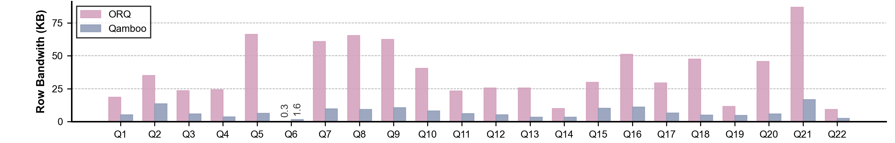
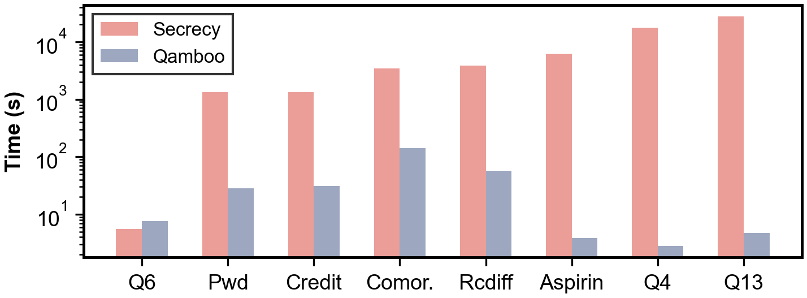
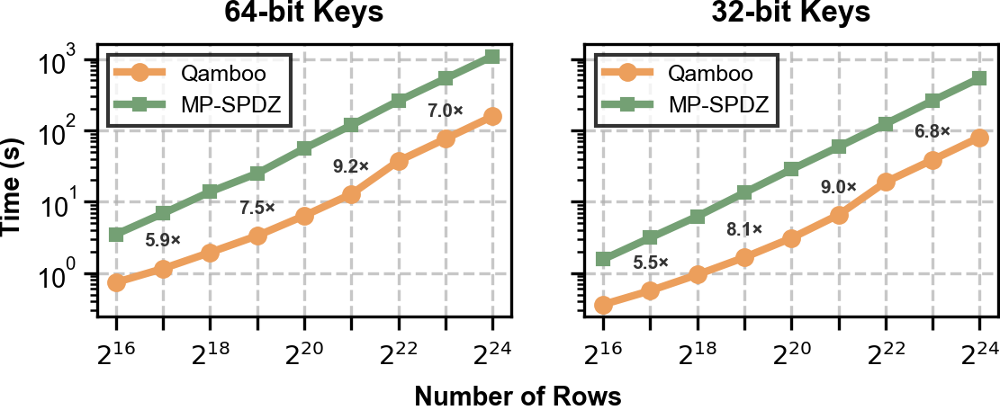
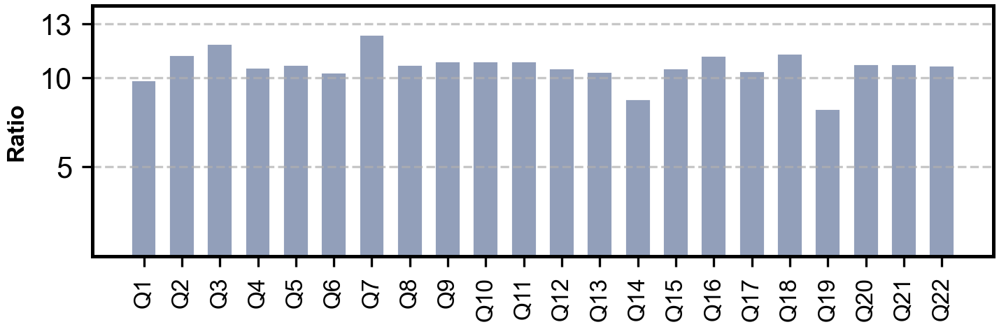
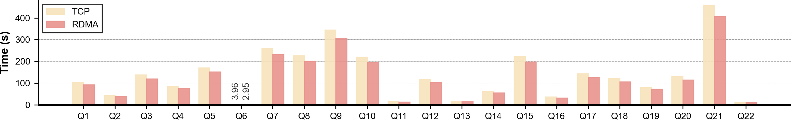

# Qamboo Artifact Evaluation Guide for NSDI 2027

Welcome to the artifact evaluation guide for Qamboo. This document provides instructions to reproduce the results published in the NSDI 2027 paper, *Qamboo: Efficient and Scalable Secure Collaborative Analytics
in the Cloud*. For information on how to use the framework and build applications, please refer to the main [README](../README.md) file.

We are applying for all three badges: {[Available](#available-badge), [Functional](#functional-badge), [Reproduced](#reproduced-badge)}.

## Available Badge

We make the artifact available to reviewers in our [GitHub repository](https://github.com/Shwenli/Qamboo) <!-- TODO: fill in after the org transfer -->, which includes a README file highlighting the key dependencies, a getting-started guide, and the main features. Additionally, we provide documentation of the framework modules under [`docs/`](../docs/) and of the experiment scripts under [`scripts/README.md`](../scripts/README.md).

We plan to attach an open-source license (MIT, already included as [LICENSE](../LICENSE)) to the artifact. <!-- TODO: add Zenodo DOI -->

## Functional Badge

We provide Qamboo, a modular and extensible MPC framework for secure collaborative analytics, implemented in ~20,000 lines of Rust. Qamboo performance is significantly better than state-of-the-art systems on the full TPC-H benchmark and on representative secure analytics workloads. Full API documentation is available at the [project docs page](https://shwenli.github.io/Qamboo/).

We demonstrate this through the following components (see the main [README](../README.md#architecture) for the full architecture):

1. `protocols/`: The 3-party replicated secret-sharing protocol.
2. `algebra/`: Ring arithmetic foundations.
3. `primitives/`: Secure building blocks — comparison, permutation, shuffle, and multiplexing.
4. `operator/`: Oblivious relational operators — Join, GroupBy, Sort, Distinct, and Aggregation with O(n log n) communication.
5. `table/`: The `SharedTable` columnar abstraction and table-aware APIs (`Filter`, `Project`, `Groupby`, `Join`, `OrderBy`, `Open`) used to compose queries.
6. `net/` + `communication/`: The network stack — a transport abstraction with a TCP implementation (transparently upgradable to RDMA via SMC-R) and a communication module managing multiple parallel connections between parties.
7. `random/`: Correlated randomness generation.
8. `experiments/`: The evaluation suite — all 22 TPC-H queries, the Secrecy application benchmarks, and operator micro-benchmarks. Every query binary verifies its MPC result **bit-for-bit** against a [Polars](https://pola.rs/) plaintext baseline at the end of execution.

We provide a few examples to showcase our supported analytics:

1. `experiments/query/tpch/q9.rs`: A 6-table TPC-H query combining multi-key joins, arithmetic expressions, GroupBy aggregation, and OrderBy.
2. `experiments/query/secrecy/comorbidity.rs`: A medical comorbidity analysis from the Secrecy benchmark suite.
3. `experiments/operator/radix_sort_scalability.rs`: An oblivious RadixSort micro-benchmark scaling from 2^20 to 2^27 rows.

> [!NOTE]
> The cardinality-aware query optimizations presented in the paper are not yet applied by an automated query optimizer. Because the frontend currently exposes a dataflow API rather than standard SQL, the optimizations are applied directly when composing queries through this API. We plan to provide a SQL execution interface that integrates the automated optimizer in a future release.

## Reproduced Badge

The experimental section in the paper supports four claims:

1. <a id="claim-1"></a>Qamboo significantly outperforms state-of-the-art secure analytics systems (§7.2).
2. <a id="claim-2"></a>The cardinality-aware query optimizations are effective (§7.3).
3. <a id="claim-3"></a>Qamboo scales near-linearly with data size (§7.4).
4. <a id="claim-4"></a>RDMA acceleration provides additional gains with zero code changes (§7.5).

We compare against 3 prior state-of-the-art systems:

1. [`ORQ`](https://github.com/CASP-Systems-BU/orq) (ACM SOSP 2025): An MPC-based analytics system for complex queries, the strongest existing baseline. Configured as in its paper: 16 compute threads, 4 network connections in LAN and 16 in WAN.
2. [`Secrecy`](https://github.com/CASP-Systems-BU/Secrecy) (USENIX NSDI 2023): A 3-party outsourced secure analytics system with semi-honest security and no leakage.
3. [`MP-SPDZ`](https://github.com/data61/MP-SPDZ) (ACM CCS 2020): A general-purpose MPC framework, used as the RadixSort baseline.

> **Note:** The baseline systems are *not* vendored into this repository. This artifact reproduces the Qamboo side of every figure; for head-to-head figures, we document the baseline configuration and the exact data points so reviewers can cross-check, and `scripts/experiments/run_radix_sort_mpspdz_ssh.sh` runs the MP-SPDZ RadixSort baseline on hosts where MP-SPDZ is installed.

All Qamboo experiments run on 3 servers in the 3-party outsourced setting, according to the following tags:

1. **ALI**: Alibaba Cloud `r8i.8xlarge` instances (32 vCPUs, 256 GB RAM each). We use Ubuntu 22.04 for §7.2–§7.4 and Alibaba Cloud Linux 3.2104 LTS (with eRDMA) for §7.5.
2. **LAN**: Up to 25 Gbps bandwidth and 0.3 ms RTT.
3. **WAN**: Up to 6 Gbps bandwidth and 20 ms RTT, emulated with `tc` via `scripts/setup/setup_delay.sh`.

Unless otherwise noted, Qamboo uses 32 compute threads, 16 network connections in LAN, and 32 connections in WAN. Both Qamboo and ORQ exploit the PK–FK relationships in the TPC-H schema to enable one-to-many joins.

The experimental section has 8 experiments:

1. **[Fig 7 Execution time vs. ORQ](#fig-7-execution-time-vs-orq)**: Supports [claim #1](#claim-1) and runs in ALI-LAN and ALI-WAN.
2. **[Fig 8 Row bandwidth vs. ORQ](#fig-8-row-bandwidth-vs-orq)**: Supports [claim #1](#claim-1) and runs in ALI-LAN and ALI-WAN.
3. **[Fig 9 Execution time vs. Secrecy](#fig-9-execution-time-vs-secrecy)**: Supports [claim #1](#claim-1) and runs in ALI-LAN.
4. **[Fig 10 RadixSort vs. MP-SPDZ](#fig-10-radixsort-vs-mp-spdz)**: Supports [claim #1](#claim-1) and runs in ALI-LAN.
5. **[Fig 11 Query optimization ablations](#fig-11-query-optimization-ablations)**: Supports [claim #2](#claim-2) and runs in ALI-LAN.
6. **[Fig 13 TPC-H scaling](#fig-13-tpc-h-scaling)**: Supports [claim #3](#claim-3) and runs in ALI-LAN.
7. **[Fig 14 RadixSort scaling](#fig-14-radixsort-scaling)**: Supports [claim #3](#claim-3) and runs in ALI-LAN and ALI-WAN.
8. **[Fig 12 TCP vs. RDMA](#fig-12-tcp-vs-rdma)**: Supports [claim #4](#claim-4) and runs in ALI-LAN (eRDMA).

### Reproduction paths

We offer three levels of reproduction, from the cheapest to the most faithful:

1. **Open data (no runs needed).** The real measurements behind every figure are open-sourced under [`data/paper/`](data/paper/) (one CSV per figure: `fig7_lan_tpch.csv`, `fig7_wan_tpch.csv`, `fig8.csv`, …, `fig14.csv` — see [Experimental data](#experimental-data) for a per-file description). Together with the plotting scripts under [`plotting_scripts/`](plotting_scripts/), reviewers can regenerate every figure in the paper directly from our experimental data — see [Plotting](#plotting). No cluster, no runs, no cost. If you rerun the experiments yourself, the per-figure scripts extract your fresh measurements into [`data/run/`](data/run/) (see [Result collection](#result-collection)), keeping them separate from the published numbers.

2. **Local single-machine runs (no cluster needed).** If a 3-node cloud cluster is a cost or time concern, every benchmark can also run on a single machine: the 3 parties then run as local processes on `127.0.0.1` (`-m local`, the default mode of all runners under `scripts/experiments/`). This exercises the same binaries and the same protocol end-to-end at smaller scale factors — the [smoke test](#smoke-test-10-minutes) below is exactly such a local run (~10 minutes). Note that local runs validate functionality and relative behavior, not the paper's absolute performance numbers, which require the cluster setting below.

3. **Multi-node cluster runs (full reproduction).** The per-figure scripts under [`nsdi27-ae/scripts/`](scripts/) reproduce the paper numbers on 3 networked nodes in the ALI-LAN / ALI-WAN settings described above. Because this requires 3 networked nodes, we offer access to a ready-to-use cluster — if you choose to use it, you can skip the [Setup](#setup) section and go directly to [Experiments](#experiments). 

### Setup

**Before running any experiments, complete this setup first.** The complete setup is the following sequence of commands, run from `node0` (details for each step are in the section named in its comment):

```bash
# 1. Clone the repository (details: Qamboo installation)
git clone https://github.com/Shwenli/Qamboo.git
cd Qamboo

# 2. One-click deploy to the 3 nodes: SSH trust, /etc/hosts, RDMA,
#    Rust toolchain check, release build, distribution
#    (details: Qamboo installation)
./scripts/setup/deploy.sh -i <ip-0>,<ip-1>,<ip-2> -x node

# 3. Generate the TOML network configs (peer addresses and ports)
#    (details: Network environment)
./scripts/setup/setup_connection.sh -t lan   -h node0,node1,node2 -n 32
./scripts/setup/setup_connection.sh -t local -h localhost         -n 10

# 4. Smoke test: local 3-party Q9 at SF=0.01, ~10 minutes
#    (details: Smoke test)
./scripts/experiments/run_tpch.sh 9 -t 6 -s 0.01
```

#### Qamboo installation

Please refer to the main [README](../README.md#building-qamboo) for system requirements (Rust 1.85+). Qamboo supports two deployment modes:

**Single-machine deployment.** All 3 parties run as processes on one host, communicating over `127.0.0.1` — sufficient for the [smoke test](#smoke-test-10-minutes) and development. Simply clone the repository; the experiment runners compile the release binaries automatically on first use:

```bash
$ git clone https://github.com/Shwenli/Qamboo.git
$ cd Qamboo
$ curl --proto '=https' --tlsv1.2 -sSf https://sh.rustup.rs | sh -s -- -y   # if Rust is not installed
$ cargo build --workspace --exclude experiments --release
```

The pinned `rust-toolchain.toml` at the repository root makes rustup download and select Rust 1.90.0 automatically on the first `cargo` invocation — no version management needed.

**Multi-machine deployment.** The 3 parties run on 3 separate nodes, driven from `node0`:

1. Prepare 3 nodes connected together. Call them `node0`, `node1`, and `node2`, and ensure that `node0` has SSH access to the other two. Note that SSH access is used only for benchmarking purposes (binary distribution and remote launch) and is not required in a real production deployment.
2. Clone this repository on `node0`:
   ```bash
   $ git clone https://github.com/Shwenli/Qamboo.git
   $ cd Qamboo
   ```
3. Run the one-click deployment pipeline from `node0`, which establishes SSH trust, synchronizes `/etc/hosts`, optionally configures RDMA, checks the Rust toolchain, and builds and distributes the project to all nodes (see [`scripts/README.md`](../scripts/README.md) for details):
   ```bash
   $ ./scripts/setup/deploy.sh -i <ip-0>,<ip-1>,<ip-2> -x node
   ```

> [!TIP]
> For the best runtime performance, uncomment the following section in `Cargo.toml` before deployment (step 3). This enables link-time optimization and single-codegen-unit compilation, which produce faster binaries at the cost of a noticeably longer compile time:
>
> ```toml
> [profile.release]
> lto = "thin"
> codegen-units = 1
> panic = "abort"
> ```

After deployment, set up the network as described in [Network environment](#network-environment).

#### Network environment

The 3-party protocols communicate over TCP ports assigned in pre-generated TOML configs under `experiments/net/`: `local/` for single-machine runs (parties talk over `127.0.0.1`, 10 pre-allocated port groups starting at 9000) and `multinode/` for cluster runs (32 groups, generated from the node IPs). Each network connection (`-t`) consumes one group: LAN runs use 16 connections (groups 0–15), WAN runs use 32. Both sets are created by `scripts/setup/setup_connection.sh`:

```bash
# Multinode: run on node0; generates the configs on all 3 hosts via SSH
# (32 groups: LAN runs use 16 connections, WAN runs use 32)
$ ./scripts/setup/setup_connection.sh -t lan   -h node0,node1,node2 -n 32

# Local: loopback port groups for single-machine runs
$ ./scripts/setup/setup_connection.sh -t local -h localhost         -n 10
```

Note that these ports are statically pre-allocated in the config files — Qamboo does not detect or resolve port conflicts automatically. This is a deliberate simplification: Qamboo is an academic prototype rather than a production system, and ports on a dedicated benchmarking cluster are generally clean. If a port happens to be occupied on your machines, edit the affected `config_party*.toml` files (or regenerate them with a different base port) and rerun.

The paper's WAN experiments assume 6 Gbps bandwidth and 20 ms RTT between nodes. If the network parameters of your rented servers differ from the paper's setting, use `tc` (traffic control) to emulate them on **all three nodes**. Note that `tc` applies the delay per node, so each node adds half of the target RTT (10 ms each for a 20 ms RTT).

The WAN emulation is integrated into the Qamboo experiment scripts that take a `lan|wan` parameter (Fig 7 and Fig 14): selecting `wan` applies the `tc` rules on all nodes automatically before the run and removes them afterwards — also on failure, via a trap — so no manual configuration is needed. For manual control (e.g., when running a baseline system), `scripts/setup/setup_delay.sh` wraps the `tc` commands and can apply them to all nodes at once:

```bash
$ ./scripts/setup/setup_delay.sh -c -H node0,node1,node2 6GBit 20ms   # load on all nodes
$ ./scripts/setup/setup_delay.sh -d -H node0,node1,node2             # delete on all nodes
```

Remember to delete the `tc` rules before switching back to LAN experiments.

#### Smoke test (~10 minutes)

Before running the long experiments, verify the installation end-to-end with a small local run (3 parties as processes on one machine, SF=0.01). It builds the binary, executes Q9, and checks the result bit-for-bit against the Polars plaintext baseline. The local run uses the pre-configured loopback ports described in [Network environment](#network-environment); if you have not generated the configs yet (e.g., you are on a single machine), generate them first.

The runners take the network-connection count via `-t`; compute threads come from the Rayon pool, which auto-sizes to the machine's cores (override with `--rayon` where applicable). The minimum supported setting is **4 connections**: some low-level operators hardcode multithreaded execution, so end-to-end queries currently do not support single- or dual-connection configurations. Use `-t 4` or more.

```bash
$ ./scripts/setup/setup_connection.sh -t local -h localhost -n 10   # pre-configure local ports
$ ./scripts/experiments/run_tpch.sh 9 -t 6 -s 0.01
```

A successful run ends with `Q9: MPC result matches polars result!` in the log.

### Experiments

All of the following experiments are long-running. To avoid improper termination, please use [screen](https://linuxize.com/post/how-to-use-linux-screen/) or `tmux` to run them. All commands are run from `node0`.

Every batch runner compiles the release binaries, distributes them to `node1`/`node2` via `scp`, launches party 0 locally and parties 1 & 2 via `ssh`, and appends the timing/communication statistics to structured logs under `experiments/result/` (see [Result collection](#result-collection)). Run times below are approximate and were measured on the ALI setup described above.


#### Fig 7: Execution time vs. ORQ

(Human time: ~5 minutes, runtime: ~3.5 hours in LAN and ~8 hours in WAN, including the ORQ baseline)

This experiment supports [claim #1](#claim-1) and runs in ALI-LAN and ALI-WAN. It runs all 22 TPC-H queries at SF=1 with 32 compute threads.

```bash
$ ./nsdi27-ae/scripts/fig7/fig7_Qamboo.sh lan
$ ./nsdi27-ae/scripts/fig7/fig7_Qamboo.sh wan   # applies/removes tc emulation automatically
```

Expected: Qamboo outperforms ORQ on 21 of 22 queries (Q6 is the exception, see paper §7.2.1), with a median speedup of 2.1× and up to 4.5× (Q18) in LAN; comparable speedups in WAN.

<p align="center">
  <br>
  <em>Fig 7: Execution time of Qamboo vs. ORQ on all 22 TPC-H queries at SF=1 (LAN and WAN)</em>
</p>

#### Fig 8: Row bandwidth vs. ORQ

(Human time: ~5 minutes, runtime: ~35 hours, including the ORQ baseline)

This experiment supports [claim #1](#claim-1). It reruns all 22 TPC-H queries at SF=10; the per-query communication volume (row bandwidth) is printed by each binary via `print_communication_stats` and collected into the result logs.

```bash
$ ./nsdi27-ae/scripts/fig8/fig8_Qamboo.sh
```

Expected: Qamboo reduces communication cost by 5.1× on average over ORQ (Q6 excepted), with the largest savings on multi-way join queries (Q5: 90.5%, Q7: 84.1%, Q8: 86.0%).

<p align="center">
  <br>
  <em>Fig 8: Per-query communication volume (row bandwidth) of Qamboo vs. ORQ at SF=10</em>
</p>

#### Fig 9: Execution time vs. Secrecy

(Human time: ~5 minutes, runtime: ~17 hours, dominated by the Secrecy baseline)

This experiment supports [claim #1](#claim-1) and runs in ALI-LAN. It runs the five application queries from the Secrecy paper (`pwd`, `credit`, `comorbidity`, `rcdiff`, `aspirin`) plus TPC-H Q4, Q6, and Q13. The fig9 script uses the exact maximum input sizes reported in the Secrecy paper (the scale factors are documented and hardcoded in the script).

```bash
$ ./nsdi27-ae/scripts/fig9/fig9_Qamboo.sh -h node0,node1,node2
```

Expected: median speedup of 45× on the five Secrecy queries (up to 1632× on Aspirin) and 5836× on the three TPC-H queries (up to 6220× on Q4). Q6 is again the exception.

<p align="center">
  <br>
  <em>Fig 9: Execution time of Qamboo vs. Secrecy on the Secrecy application queries and TPC-H Q4/Q6/Q13</em>
</p>

#### Fig 10: RadixSort vs. MP-SPDZ

(Human time: ~10 minutes, runtime: ~1 hour; requires MP-SPDZ installed on the nodes)

This experiment supports [claim #1](#claim-1) and runs in ALI-LAN. It compares oblivious RadixSort at 2^16–2^24 rows for both 64-bit and 32-bit keys.

For Qamboo:

```bash
$ ./nsdi27-ae/scripts/fig10/fig10_Qamboo.sh
```

For MP-SPDZ (requires a working MP-SPDZ installation on all three nodes):

```bash
$ cd scripts/experiments
$ ./run_radix_sort_mpspdz_ssh.sh
```

Expected: median speedup of 7× (up to 9.2× at 2^21 rows) for 64-bit keys; similar speedups (5.5×–9.0×) for 32-bit keys.

<p align="center">
  <br>
  <em>Fig 10: Oblivious RadixSort execution time of Qamboo vs. MP-SPDZ (64-bit and 32-bit keys)</em>
</p>

#### Fig 11: Query optimization ablations

(Human time: ~5 minutes, runtime: ~1.5 hours)

This experiment supports [claim #2](#claim-2) and runs in ALI-LAN at SF=1. It compares the optimized binaries (`q*`) against variants with one optimization disabled (`q*_no_join_reorder`, `q*_no_secure_cut`).

(a) Smallest-first join reordering (Q2, Q5, Q7, Q8, Q9, Q10):

```bash
$ ./nsdi27-ae/scripts/fig11/fig11_a.sh
```

(b) Secure group cutting (Q2, Q3, Q5, Q8, Q13, Q17, Q18, Q20, Q21):

```bash
$ ./nsdi27-ae/scripts/fig11/fig11_b.sh
```

The corresponding optimized numbers come from the Fig 7 run at SF=1. Expected: join reordering gives a median speedup of 1.6× (up to 2.0× on Q8); secure group cutting gives a median speedup of 1.8× (up to 2.9× on Q13).

<p align="center">
  <br>
  <em>Fig 11a: Effect of smallest-first join reordering</em>
</p>

<p align="center">
  <br>
  <em>Fig 11b: Effect of secure group cutting</em>
</p>

#### Fig 13: TPC-H scaling

(Human time: ~2 minutes, runtime: included in Figs 7–8)

This experiment supports [claim #3](#claim-3) and runs in ALI-LAN. No extra runs are needed: take the per-query execution times at SF=1 ([Fig 7](#fig-7-execution-time-vs-orq)) and SF=10 ([Fig 8](#fig-8-row-bandwidth-vs-orq)) and compute the SF=10/SF=1 ratio for each query.

Expected: an average ratio of ~10.5× across all 22 queries, close to the theoretical 11.5×–12× growth of the O(n log n) operators.

<p align="center">
<p align="center">
  <br>
  <em>Fig 13: TPC-H scaling ratio (SF=10 vs. SF=1) per query</em>
</p>
</p>

#### Fig 14: RadixSort scaling

(Human time: ~5 minutes, runtime: ~1.25 hours in LAN and ~2.25 hours in WAN)

This experiment supports [claim #3](#claim-3) and runs in ALI-LAN and ALI-WAN. It sweeps oblivious RadixSort from 2^20 to 2^27 rows for 64-bit and 32-bit keys in both network settings.

```bash
$ ./nsdi27-ae/scripts/fig14/fig14_Qamboo.sh lan
$ ./nsdi27-ae/scripts/fig14/fig14_Qamboo.sh wan   # applies/removes tc emulation automatically
```

Run it once in LAN, and once more in WAN (the script applies the `tc` delay emulation itself, see [Setup](#qamboo-installation)). For the RDMA environment (not WAN), use `./scripts/experiments/run_operator.sh radix_sort_scalability -m rdma` instead.

Expected: execution time grows linearly with input size in both settings; 32-bit keys are ~2× faster than 64-bit keys; the WAN/LAN gap narrows from ~3× to ~2× as data grows.

<p align="center">
  <br>
  <em>Fig 14: RadixSort scaling from 2^20 to 2^27 rows in LAN and WAN</em>
</p>

#### Fig 12: TCP vs. RDMA

(Human time: ~5 minutes, runtime: ~1.5 hours; requires eRDMA-capable instances)

This experiment supports [claim #4](#claim-4) and runs in ALI-LAN on Alibaba Cloud Linux 3.2104 LTS with eRDMA enabled. It reruns all 22 TPC-H queries at SF=1 twice: once over TCP, once over RDMA via SMC-R (transparent at the socket layer, no code changes). See `scripts/setup/setup_rdma.sh` for the environment setup.

```bash
$ ./nsdi27-ae/scripts/fig12/fig12_tcp.sh   # TCP baseline
$ ./nsdi27-ae/scripts/fig12/fig12_rdma.sh  # RDMA (SMC-R)
```

Expected: RDMA reduces execution time by a median of 11.3% (up to 25.6% on Q6).

<p align="center">
  <br>
  <em>Fig 12: TCP vs. RDMA (SMC-R) execution time on all 22 TPC-H queries at SF=1</em>
</p>

### Result collection

All batch runners strip ANSI color codes and append the `INFO Total ...` timing lines and the per-query communication statistics into structured logs:

| Experiment | Log path |
|:---|:---|
| TPC-H (multinode) | `experiments/result/tpch_query/multinode/stat_output.log` |
| TPC-H (local smoke tests) | `experiments/result/tpch_query/local/stat_output.log` |
| Secrecy applications | `experiments/result/secrecy_query/multinode/stat_output.log` |
| Operator micro-benchmarks | `experiments/result/operator/multinode/stat_output.log` |

Each TPC-H query binary also prints its end-to-end time (`Total Q* execution time`) and per-party communication volume (`print_communication_stats`), and asserts the MPC result bit-for-bit against the Polars plaintext baseline before exiting — a failed assertion indicates an incorrect run and should be reported.

**Data extraction.** After the run finishes, every per-figure script under [`scripts/`](scripts/) automatically parses its result log into a CSV under [`data/run/`](data/run/), using the extractors in [`plotting_scripts/`](plotting_scripts/):

- `extract_qamboo_log_data.py` — Qamboo logs (`Total Q* execution time` / `Total ... Communication Sent ... MB`, RadixSort `took:` lines; `--delta` converts the cumulative per-party communication counters of the operator benchmarks into per-task traffic; `--labels` merges several logs into one pivoted CSV).
- `extract_orq_log.py` — ORQ and Secrecy per-query logs (`[ SW] <stage> <t> sec`, `[=SW] Overall <t> sec`; `--median` collapses repeated runs).
- `extract_mpspdz_log.py` — MP-SPDZ logs (`Spent <t> seconds ... online/offline phase`, per exponent).

Two directories keep the data sources apart: [`data/paper/`](data/paper/) holds the published measurements behind the paper's figures (used by default by the plotting scripts), while [`data/run/`](data/run/) receives the CSVs extracted from your own runs. Note that the Qamboo logs are cumulative across runs of the same experiment type (e.g. Figs 7, 8, and 12-TCP share `experiments/result/tpch_query/multinode/stat_output.log`), and the extractors keep the latest value per query — so an extracted CSV reflects the most recent run recorded in the log.

### Experimental data

The real measurements behind every figure are open-sourced under [`data/paper/`](data/paper/), one CSV per figure. Each CSV is the exact input of the corresponding script in [`plotting_scripts/`](plotting_scripts/), so every figure in the paper can be regenerated directly from these files (see [Plotting](#plotting)).

| CSV | Figure | Contents |
|:---|:---|:---|
| `fig7_lan_tpch.csv`, `fig7_wan_tpch.csv` | Fig 7 | Execution time (s) of Qamboo vs. ORQ on all 22 TPC-H queries at SF=10, in LAN and WAN, plus the per-query speedup. |
| `fig8.csv` | Fig 8 | Communication sent (MB) and row bandwidth of Qamboo vs. ORQ per TPC-H query at SF=10. |
| `fig9.csv` | Fig 9 | Execution time (s) of Qamboo vs. Secrecy on the privacy-preserving applications (Q6, Pwd, Credit, Comor., Rcdiff, Aspirin, Q4, Q13). |
| `fig10.csv` | Fig 10 | Oblivious RadixSort execution time (s) and communication (MB) of Qamboo vs. MP-SPDZ, 2^16–2^24 rows, for 64-bit and 32-bit keys. |
| `fig11.csv` | Fig 11 | Query-optimization ablations per TPC-H query: execution time (s) and communication (MB) of full Qamboo, the no-join-reorder variant, and the no-secure-cut variant. |
| `fig12.csv` | Fig 12 | Execution time (s) over TCP vs. eRDMA on all 22 TPC-H queries. |
| `fig13.csv` | Fig 13 | TPC-H scaling from SF=1 to SF=10: per-query execution time (s) and the SF10/SF1 ratio, over TCP and eRDMA. |
| `fig14.csv` | Fig 14 | RadixSort scaling from 2^20 to 2^27 rows in LAN and WAN, for 64-bit and 32-bit keys: execution time (s). |

### Plotting

Each script `plotting_scripts/fig<N>.py` reads its CSV from [`data/paper/`](data/paper/) by default and writes the figure (PDF + PNG) to [`figures/paper/`](figures/paper/) — like `data/`, the `figures/` directory is split into `paper/` (the published figures) and `run/` (figures from your own measurements):

```bash
$ cd nsdi27-ae/plotting_scripts
$ python3 fig7.py     # regenerates figures/paper/fig7.pdf from data/paper/
```

To plot your own measurements instead, pass `--source run` — every plotting script then reads its default CSV from [`data/run/`](data/run/) instead of `data/paper/` and writes to `figures/run/` (the CSV must use the paper's filename and column layout; the extractors below produce raw per-run data, so assemble the figure CSV the same way `data/paper/` does). An explicitly passed CSV path or output path always takes precedence over `--source`:

```bash
$ python3 fig7.py --source run                       # data/run/fig7_*_tpch.csv -> figures/run/fig7.pdf
$ python3 fig12.py ../data/run/fig12.csv             # explicit path also works
```

The extraction step itself can also be rerun standalone (it already runs automatically at the end of each per-figure experiment script):

```bash
$ python3 extract_qamboo_log_data.py -i ../../experiments/result/tpch_query/multinode/stat_output.log -o ../data/run/fig7_qamboo_lan.csv
$ python3 extract_orq_log.py -i ../baselines/orq/results/query-benchmark/tpch/<timestamp>-3PC-lan-SF1/raw_data --median -o ../data/run/fig7_orq_lan.csv
$ python3 extract_mpspdz_log.py -i ../data/run/fig10_mpspdz.log -o ../data/run/fig10_mpspdz.csv
```
