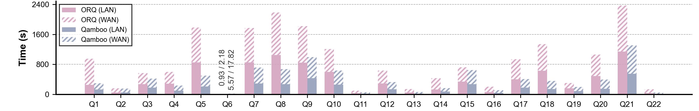
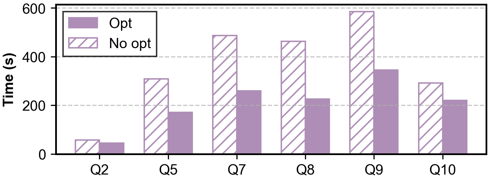
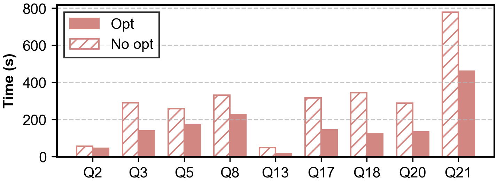
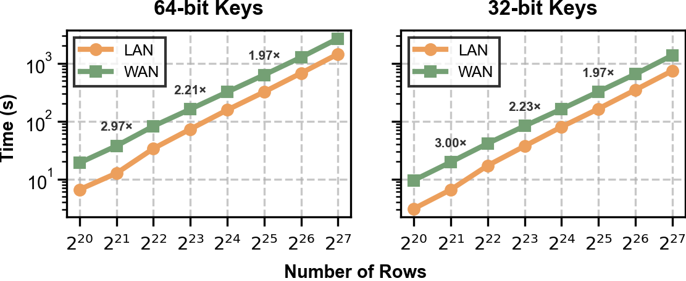

# Qamboo Artifact Evaluation Guide for NSDI 2027

Welcome to the artifact evaluation guide for Qamboo. This document provides instructions to reproduce the results published in the NSDI 2027 paper, *Qamboo: Efficient and Scalable Secure Collaborative Analytics
in the Cloud*. For information on how to use the framework and build applications, please refer to the main [README](../README.md) file.

We are applying for all three badges: {[Available](#available-badge), [Functional](#functional-badge), [Reproduced](#reproduced-badge)}.

## Available Badge

We make the artifact available to reviewers in our [GitHub repository](https://github.com/Shwenli/Qamboo) <!-- TODO: fill in after the org transfer -->, which includes a README file highlighting the key dependencies, a getting-started guide, and the main features. Additionally, we provide documentation of the framework modules under [`docs/`](../docs/) and of the experiment scripts under [`scripts/README.md`](../scripts/README.md).

We plan to attach an open-source license (MIT OR Apache-2.0, already included as [LICENSE](../LICENSE)) to the artifact and upload it to Zenodo after approval and before the artifact decision deadline. <!-- TODO: add Zenodo DOI -->

## Functional Badge

We provide a modular and extensible MPC framework for secure collaborative analytics, implemented in ~20,000 lines of Rust. Our main claim is that our low-overhead oblivious operator design and cardinality-aware query optimization yield a compact artifact whose performance is significantly better than state-of-the-art systems on the full TPC-H benchmark and on representative secure analytics workloads.

We demonstrate this through the following components (see the main [README](../README.md#architecture) for the full architecture):

1. `protocols/`: The 3-party replicated secret-sharing protocol (semi-honest), arithmetic and boolean operations.
2. `algebra/`: Ring and finite-field arithmetic foundations (referencing arkworks and co-snarks).
3. `primitives/`: Secure building blocks — comparison, permutation, shuffle, and multiplexing.
4. `operator/`: Oblivious relational operators — Join, GroupBy, Sort, Distinct, and Aggregation with O(n log n) communication.
5. `table/`: The `SharedTable` columnar abstraction and table-aware APIs (`Filter`, `Project`, `Groupby`, `Join`, `OrderBy`, `Open`) used to compose queries.
6. `net/` + `communication/`: The network stack — a transport abstraction with a TCP implementation (transparently upgradable to RDMA via SMC-R) and a communication module managing multiple parallel connections between parties.
7. `random/`: Correlated randomness generation.
8. `experiments/`: The evaluation suite — all 22 TPC-H queries, the Secrecy application benchmarks, and operator micro-benchmarks. Every query binary verifies its MPC result **bit-for-bit** against a [Polars](https://pola.rs/) plaintext baseline at the end of execution.

We provide a few examples to showcase our supported analytics:

1. `experiments/query/tpch/q9.rs`: A 6-table TPC-H query combining multi-key joins, arithmetic expressions, GroupBy aggregation, and OrderBy.
2. `experiments/query/secrecy/comorbidity.rs`: A medical comorbidity analysis from the Secrecy benchmark suite.
3. `experiments/operator/radix_sort_scalability.rs`: An oblivious RadixSort micro-benchmark scaling from 2^20 to 2^27 rows.

> **Note:** The cardinality-aware query optimizations presented in the paper are not yet applied by an automated query optimizer. Because the frontend currently exposes a dataflow API rather than standard SQL, the optimizations are applied directly when composing queries through this API. We plan to provide a SQL execution interface that integrates the automated optimizer in a future release.

## Reproduced Badge

The experimental section in the paper supports four claims: (i) Qamboo significantly outperforms state-of-the-art secure analytics systems (§7.2), (ii) the cardinality-aware query optimizations are effective (§7.3), (iii) Qamboo scales near-linearly with data size (§7.4), and (iv) RDMA acceleration provides additional gains with zero code changes (§7.5).

We compare against 3 prior state-of-the-art systems:

1. `ORQ` (ACM SOSP 2025): An MPC-based analytics system for complex queries, the strongest existing baseline. Configured as in its paper: 16 compute threads, 4 network connections in LAN and 16 in WAN.
2. `Secrecy` (USENIX NSDI 2023): A 3-party outsourced secure analytics system with semi-honest security and no leakage.
3. [`MP-SPDZ`](https://github.com/data61/MP-SPDZ) (ACM CCS 2020): A general-purpose MPC framework, used as the RadixSort baseline.

> **Note:** The baseline systems are *not* vendored into this repository. This artifact reproduces the Qamboo side of every figure; for head-to-head figures, we document the baseline configuration and the exact data points so reviewers can cross-check, and `scripts/experiments/operator/multinode/run_radix_sort_mpspdz_ssh.sh` runs the MP-SPDZ RadixSort baseline on hosts where MP-SPDZ is installed.

All Qamboo experiments run on 3 servers in the 3-party outsourced setting, according to the following tags:

1. **ALI**: Alibaba Cloud `r8i.8xlarge` instances (32 vCPUs, 256 GB RAM each). We use Ubuntu 22.04 for §7.2–§7.4 and Alibaba Cloud Linux 3.2104 LTS (with eRDMA) for §7.5.
2. **LAN**: Up to 25 Gbps bandwidth and 0.3 ms RTT.
3. **WAN**: Up to 6 Gbps bandwidth and 20 ms RTT, emulated with `tc` via `scripts/setup/setup_delay.sh`.

Unless otherwise noted, Qamboo uses 32 compute threads, 16 network connections in LAN, and 32 connections in WAN. Both Qamboo and ORQ exploit the PK–FK relationships in the TPC-H schema to enable one-to-many joins.

The experimental section has 8 experiments:

1. **[Fig 7 Execution time vs. ORQ](#fig-7-execution-time-vs-orq)**: Supports claim #1 and runs in ALI-LAN and ALI-WAN.
2. **[Fig 8 Row bandwidth vs. ORQ](#fig-8-row-bandwidth-vs-orq)**: Supports claim #1 and runs in ALI-LAN and ALI-WAN.
3. **[Fig 9 Execution time vs. Secrecy](#fig-9-execution-time-vs-secrecy)**: Supports claim #1 and runs in ALI-LAN.
4. **[Fig 10 RadixSort vs. MP-SPDZ](#fig-10-radixsort-vs-mp-spdz)**: Supports claim #1 and runs in ALI-LAN.
5. **[Fig 11 Query optimization ablations](#fig-11-query-optimization-ablations)**: Supports claim #2 and runs in ALI-LAN.
6. **[Fig 13 TPC-H scaling](#fig-13-tpc-h-scaling)**: Supports claim #3 and runs in ALI-LAN.
7. **[Fig 14 RadixSort scaling](#fig-14-radixsort-scaling)**: Supports claim #3 and runs in ALI-LAN and ALI-WAN.
8. **[Fig 12 TCP vs. RDMA](#fig-12-tcp-vs-rdma)**: Supports claim #4 and runs in ALI-LAN (eRDMA).

### Setup

Because the artifact evaluation requires 3 networked nodes, we offer access to a ready-to-use cluster. If you choose to use it, you can skip this section and go directly to the [experiments section](#experiments) below. <!-- TODO: confirm cluster access for reviewers -->

#### Qamboo installation

Please refer to the main [README](../README.md#quick-start) for system requirements (Rust 1.85+). For the multi-node experiments, we install as follows:

1. Prepare 3 nodes connected together. Call them `node0`, `node1`, and `node2`, and ensure that `node0` has SSH access to the other two. Note that SSH access is used only for benchmarking purposes (binary distribution and remote launch) and is not required in a real production deployment.
2. Clone this repository on `node0` and enter the directory:
   ```bash
   $ git clone https://github.com/<org>/Qamboo   # TODO: fill in after the org transfer
   $ cd Qamboo
   ```
3. Run the one-click deployment pipeline from `node0`, which establishes SSH trust, synchronizes `/etc/hosts`, optionally configures RDMA, and builds and distributes the project to all nodes (see [`scripts/README.md`](../scripts/README.md) for details):
   ```bash
   $ cd scripts/setup
   $ ./deploy.sh -i <ip-0>,<ip-1>,<ip-2> -x node
   ```
4. Generate the TOML network configs for the 3-party protocol on all hosts (16 connection groups for multinode, 10 for local single-machine runs):
   ```bash
   $ ./setup_connection.sh -t lan   -h node0,node1,node2 -n 16
   $ ./setup_connection.sh -t local -h localhost         -n 10
   ```
   For WAN experiments, additionally emulate the 20 ms RTT / 6 Gbps setting:
   ```bash
   $ ./setup_delay.sh   # uses tc; run on all nodes as documented in scripts/README.md
   ```

#### Smoke test (~10 minutes)

Before running the long experiments, verify the installation end-to-end with a small local run (3 parties as processes on one machine, SF=0.01). It builds the binary, executes Q9, and checks the result bit-for-bit against the Polars plaintext baseline:

```bash
$ cd scripts/experiments/tpch
$ ./local/run_q9.sh 6 0.01
```

A successful run ends with `Q9: MPC result matches polars result!` in the log.

### Experiments

All of the following experiments are long-running. To avoid improper termination, please use [screen](https://linuxize.com/post/how-to-use-linux-screen/) or `tmux` to run them. All commands are run from `node0`.

Every batch runner compiles the release binaries, distributes them to `node1`/`node2` via `scp`, launches party 0 locally and parties 1 & 2 via `ssh`, and appends the timing/communication statistics to structured logs under `experiments/result/` (see [Result collection](#result-collection)). Run times below are approximate and were measured on the ALI setup described above.

#### Fig 7: Execution time vs. ORQ

(Human time: ~5 minutes, runtime: ~3.5 hours in LAN and ~8 hours in WAN, including the ORQ baseline)

This experiment supports claim #1 and runs in ALI-LAN and ALI-WAN. It runs all 22 TPC-H queries at SF=1 with 32 compute threads.

```bash
$ cd scripts/experiments/tpch
$ ./run_multinode_exp.sh 32 1 "1..22" -h1 node1 -h2 node2
```

Expected: Qamboo outperforms ORQ on 21 of 22 queries (Q6 is the exception, see paper §7.2.1), with a median speedup of 2.1× and up to 4.5× (Q18) in LAN; comparable speedups in WAN.



#### Fig 8: Row bandwidth vs. ORQ

(Human time: ~5 minutes, runtime: ~35 hours, including the ORQ baseline)

This experiment supports claim #1. It reruns all 22 TPC-H queries at SF=10; the per-query communication volume (row bandwidth) is printed by each binary via `print_communication_stats` and collected into the result logs.

```bash
$ cd scripts/experiments/tpch
$ ./run_multinode_exp.sh 32 10 "1..22" -h1 node1 -h2 node2
```

Expected: Qamboo reduces communication cost by 5.1× on average over ORQ (Q6 excepted), with the largest savings on multi-way join queries (Q5: 90.5%, Q7: 84.1%, Q8: 86.0%).


#### Fig 9: Execution time vs. Secrecy

(Human time: ~5 minutes, runtime: ~17 hours, dominated by the Secrecy baseline)

This experiment supports claim #1 and runs in ALI-LAN. It runs the five application queries from the Secrecy paper (`pwd`, `credit`, `comorbidity`, `rcdiff`, `aspirin`) plus TPC-H Q4, Q6, and Q13. The batch runner below uses the exact maximum input sizes reported in the Secrecy paper (the scale factors are documented and hardcoded at the top of the script).

```bash
$ cd scripts/experiments/secrecy
$ ./run_multinode_exp_paper.sh -h1 node1 -h2 node2
```

Expected: median speedup of 45× on the five Secrecy queries (up to 1632× on Aspirin) and 5836× on the three TPC-H queries (up to 6220× on Q4). Q6 is again the exception.


#### Fig 10: RadixSort vs. MP-SPDZ

(Human time: ~10 minutes, runtime: ~1 hour; requires MP-SPDZ installed on the nodes)

This experiment supports claim #1 and runs in ALI-LAN. It compares oblivious RadixSort at 2^16–2^24 rows for both 64-bit and 32-bit keys.

For Qamboo:

```bash
$ cd scripts/experiments/operator/multinode
$ ./run_radix_sort_compare_ssh.sh
```

For MP-SPDZ (requires a working MP-SPDZ installation on all three nodes):

```bash
$ ./run_radix_sort_mpspdz_ssh.sh
```

Expected: median speedup of 7× (up to 9.2× at 2^21 rows) for 64-bit keys; similar speedups (5.5×–9.0×) for 32-bit keys.


#### Fig 11: Query optimization ablations

(Human time: ~5 minutes, runtime: ~1.5 hours)

This experiment supports claim #2 and runs in ALI-LAN at SF=1. It compares the optimized binaries (`q*`) against variants with one optimization disabled (`q*_no_join_reorder`, `q*_no_secure_cut`).

(a) Smallest-first join reordering (Q2, Q5, Q7, Q8, Q9, Q10):

```bash
$ cd scripts/experiments/optimization/no_join_reorder
$ ./run_multinode_exp.sh 32 1 "2,5,7,8,9,10" -h1 node1 -h2 node2
```

(b) Secure group cutting (Q2, Q3, Q5, Q8, Q13, Q17, Q18, Q20, Q21):

```bash
$ cd scripts/experiments/optimization/no_secure_cut
$ ./run_multinode_exp.sh 32 1 "2,3,5,8,13,17,18,20,21" -h1 node1 -h2 node2
```

The corresponding optimized numbers come from the Fig 7 run at SF=1. Expected: join reordering gives a median speedup of 1.6× (up to 2.0× on Q8); secure group cutting gives a median speedup of 1.8× (up to 2.9× on Q13).





#### Fig 13: TPC-H scaling

(Human time: ~2 minutes, runtime: included in Figs 7–8)

This experiment supports claim #3 and runs in ALI-LAN. No extra runs are needed: take the per-query execution times at SF=1 ([Fig 7](#fig-7-execution-time-vs-orq)) and SF=10 ([Fig 8](#fig-8-row-bandwidth-vs-orq)) and compute the SF=10/SF=1 ratio for each query.

Expected: an average ratio of ~10.5× across all 22 queries, close to the theoretical 11.5×–12× growth of the O(n log n) operators.


#### Fig 14: RadixSort scaling

(Human time: ~5 minutes, runtime: ~1.25 hours in LAN and ~2.25 hours in WAN)

This experiment supports claim #3 and runs in ALI-LAN and ALI-WAN. It sweeps oblivious RadixSort from 2^20 to 2^27 rows for 64-bit and 32-bit keys in both network settings.

```bash
$ cd scripts/experiments/operator/multinode
$ ./run_radix_sort_scalability_ssh.sh
```

Run it once in LAN, and once more in WAN after applying the `tc` delay emulation ([Setup](#qamboo-installation)). The `*_ssh_rdma.sh` variant is for the RDMA environment, not for WAN.

Expected: execution time grows linearly with input size in both settings; 32-bit keys are ~2× faster than 64-bit keys; the WAN/LAN gap narrows from ~3× to ~2× as data grows.



#### Fig 12: TCP vs. RDMA

(Human time: ~5 minutes, runtime: ~1.5 hours; requires eRDMA-capable instances)

This experiment supports claim #4 and runs in ALI-LAN on Alibaba Cloud Linux 3.2104 LTS with eRDMA enabled. It reruns all 22 TPC-H queries at SF=1 twice: once over TCP, once over RDMA via SMC-R (transparent at the socket layer, no code changes). See `scripts/setup/setup_rdma.sh` for the environment setup.

```bash
$ cd scripts/experiments/tpch
$ ./run_multinode_exp.sh 32 1 "1..22" -h1 node1 -h2 node2        # TCP baseline
$ ./run_multinode_rdma_exp.sh 32 1 "1..22" -h1 node1 -h2 node2  # RDMA (SMC-R)
```

Expected: RDMA reduces execution time by a median of 11.3% (up to 25.6% on Q6).


### Result collection

All batch runners strip ANSI color codes and append the `INFO Total ...` timing lines and the per-query communication statistics into structured logs:

| Experiment | Log path |
|:---|:---|
| TPC-H (multinode) | `experiments/result/tpch_query/multinode/stat_output.log` |
| TPC-H (local smoke tests) | `experiments/result/tpch_query/local/stat_output.log` |
| Secrecy applications | `experiments/result/secrecy_query/multinode/stat_output.log` |
| Operator micro-benchmarks | `experiments/result/operator/multinode/stat_output.log` |

Each TPC-H query binary also prints its end-to-end time (`Total Q* execution time`) and per-party communication volume (`print_communication_stats`), and asserts the MPC result bit-for-bit against the Polars plaintext baseline before exiting — a failed assertion indicates an incorrect run and should be reported.

### Plotting

<!-- TODO: add the plotting/data-extraction scripts (e.g. nsdi27-replication/plotting/) that parse the logs above into the paper figures, then document them here. -->

The logs under `experiments/result/` can be parsed directly with `awk`/`grep`/Python. To compare against the paper, extract the per-query `Total Q* execution time` values for Figs 7, 9, 11, 12, and 13, and the communication volumes for Fig 8, then normalize against the baseline data points reported in §7 of the paper.
